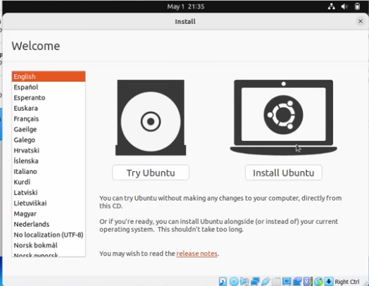
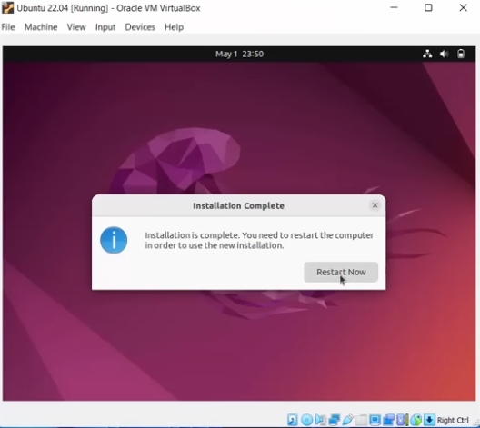

# OS-EX.2-INSTALLATION-OF-OS---CASE-STUDY

# AIM:
To install OS(Ubuntu) using VirtualBox.
# REQUIREMENTS:
Hardware Requirements: PC
Software Requirements: VitrualBox , Ubuntu.
# PROCEDURE:
#### Step 1 : 
Download Oracle Virtual box. Virtual box is a software that is used to download any OS virtually. Visit the website and download VirtualBox followed by finishing the installation in your PC.

#### Step 2:  
Download any OS(iso doc). Visit Ubuntu website and download the latest version of Ubuntu.

#### Step 3: 
Open VirtualBox and add the OS. Open the Oracle VirtualBox Manager. 
#### Step 4 : 
Click on New

#### Step 5 :  
Name the OS

#### Step 6 : 
Customize the memory size

#### Step 7 : 
Customize the hard disk 

#### Step 8 : 
Customize the options that are required and Finish the steps. Include the iso file in storage and click OK

#### Step 9 : 
Double click on the OS to power on the system and click on install ubuntu.

#### Step 10 : 
Choose your preferred language and proceed .

#### Step 11 : 
Install Ubuntu.

#### Step 12 : 
Name the computer.

#### Step 13 : 
Restart again to complete the installation

#### Step 14 : 
The installation of the OS using VirtualBox is completed. PowerOff the system after use.

# RESULT:
Thus the installation of the OS (Ubuntu) using VirtualBox is done successfully.